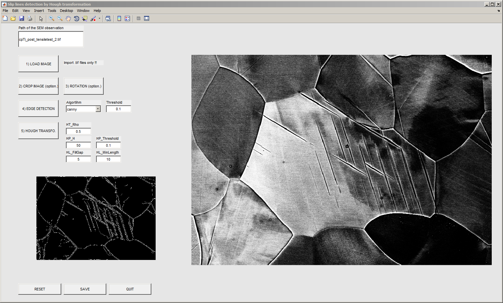
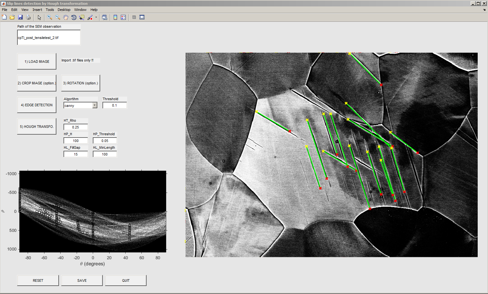

HoughTransformation
=======================
This Matlab toolbox has been developed to plot and to analyze SEM micrographs.
Slip lines detection on SEM micrograph by Hough transformation is implemented in this GUI.

The Image Processing Toolbox™ of Matlab is required.

Author
------
Written by D. Mercier [1].

[1] Max-Planck-Institut für Eisenforschung, 40237 Düsseldorf, Germany (http://www.mpie.de/)

Keywords
---------
Matlab toolbox ; Graphical User Interface ; SEM ; slip lines ; Hough transformation.

Screenshots
-------------

   
   *Figure 1 : Edge detection step.*
   

   
   *Figure 2 : Hough transofrmation and slip lines detection.*