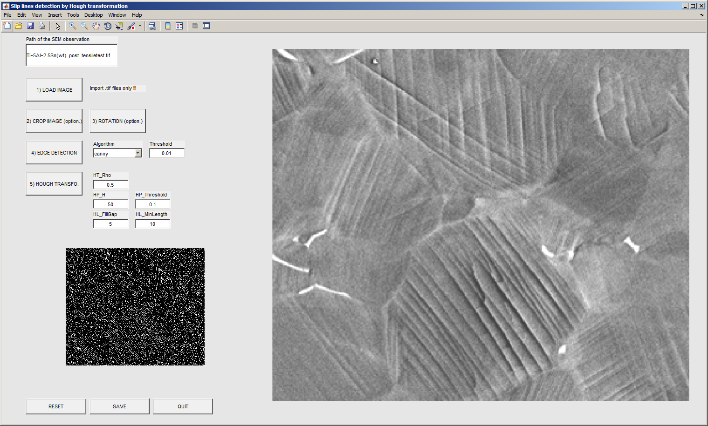

HoughTransformation
=======================
This Matlab toolbox has been developed to plot and to analyze SEM micrographs.
Slip lines detection on SEM micrograph by Hough transformation is implemented in this GUI.

The Image Processing Toolbox™ of Matlab is required.

Author
------
:Author: `David Mercier <david9684@gmail.com>`_ [1]

[1] `Max-Planck-Institut für Eisenforschung, 40237 Düsseldorf, Germany <http://www.mpie.de/>`_

Keywords
---------
Matlab toolbox ; Graphical User Interface ; SEM ; slip lines ; Hough transformation.

Screenshots
-------------

   
   *Figure 1 : Loading of the picture.*
   

   
   *Figure 2 : Crop and rotation steps.*
   

   
   *Figure 3 : Display of the cropped and rotated picture.*
   

   
   *Figure 4 : Edge detection step.*
   

   
   *Figure 5 : Hough transformation and slip lines detection.*
